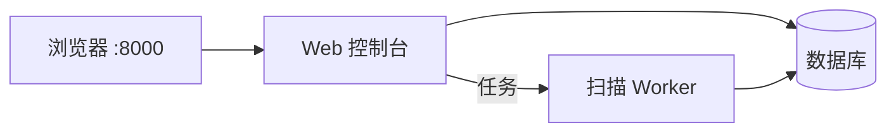

# AtlasX

**企业暴露面收集与持续监控的自托管系统。**

录入企业与根域后，AtlasX 从证书透明、测绘引擎、被动 DNS、搜索与可选主动探测等多路来源汇总影子资产，整理成可归属的资产库；完成存活探测、指纹识别与路径发现，并给出可解释的风险线索与跨轮变更对照。数据保存在本机数据库，密钥与凭据由你自行保管。

```text
http://<主机>:8000/?token=<访问令牌>
```

## 它能做什么

子域工具往往只给一张扁平清单。AtlasX 面向实战作业台：

- **连得起来** — 资产带来源与置信度，归属到企业 / 项目，并可与历史扫描对照
- **看得懂** — 优先看哪条、依据是什么，而不是黑盒分数
- **跟得住** — Web 常驻运行，凭据加密保存；支持持续扫描与变更跟踪
- **可扩展** — 免 key 源即可首扫；在设置中按需接入 FOFA、Shodan 等商业测绘与 LLM

### 采集

- 免 key 即可跑通（如证书透明、subfinder 等）
- 支持 FOFA / Quake / Shodan / Censys / Chaos / ZoomEye，以及 Bing、搜狗、GitHub 等扩展源（设置页配置后启用）
- 被动采集与主动爆破分离：主动探测需显式勾选，避免误扫面过大

### 分析与作业

- 泛解析噪声折叠，降低垃圾子域干扰
- 多源交叉佐证，提升资产可信度
- 存活探测、应用指纹、路径与 API 面线索写入资产详情
- 按企业 / 项目组织扫描；资产台、关联与变更页支持持续跟进
- 可选接入 LLM，辅助理解与预筛（默认不强制开启）

### 版本能力

| | 标准版 | Pro（License 解锁） |
|---|---|---|
| 采集、存活、指纹、资产作业台 | ✅ | ✅ |
| 深挖分析、查询 API、Webhook | — | ✅ |
| 企业暴露面威胁报告、手测清单 | — | ✅ |

未激活 License 时按标准版使用；激活后在设置中解锁 Pro 能力。

## 快速开始

**环境**：Linux（Debian / Ubuntu / Kali 等）、Docker 与 Docker Compose v2，可访问 `ghcr.io`。

```bash
git clone https://github.com/yingfff123/AtlasX.git && cd AtlasX && bash setup.sh
```

安装结束后，终端会打印访问地址。使用 `.env` 中的 `RADAR_ACCESS_TOKEN` 打开：

```text
http://<主机>:8000/?token=<RADAR_ACCESS_TOKEN>
```

首次登录账号（**登录后请立刻修改密码**）：

| 用户名 | 初始密码 |
|--------|----------|
| `adminx` | `Atlasx123!@#` |

## 使用流程

1. 打开 Web，登录并修改默认密码。
2. 在设置中按需填写测绘、搜索或 LLM 凭据（也可先用免 key 源完成第一次扫描）。
3. 创建企业，录入根域，发起扫描；主动爆破类选项仅在需要时勾选。
4. 在资产台查看存活、指纹、路径与风险，结合关联与变更持续跟进；需要时激活 Pro。
5. 日常升级执行 `bash update.sh`（默认保留已有数据）。

## 架构



| 组件 | 说明 |
|------|------|
| **Web** | 界面、登录鉴权、扫描与设置 |
| **Worker** | 后台采集与富化 |
| **数据库** | 资产与扫描结果持久化（随安装自动初始化） |

## 升级与数据

```bash
cd AtlasX
bash update.sh
```

- 应用与镜像升级：使用本仓库的 `update.sh`。
- 在线检查更新也可在 **设置 → 系统** 中操作（通道说明见 [AtlasX-updates](https://github.com/yingfff123/AtlasX-updates)）。

数据默认保留。若需要清空后重装：

```bash
docker compose down -v
docker compose pull
docker compose up -d
```

## 安全建议

- 访问令牌与各类 API Key 只保存在主机 `.env` 或系统设置中，不要发到公开渠道。
- 不要将数据库端口映射到公网；若 8000 对公网开放，请使用足够强的访问令牌，并尽快修改默认管理员密码。
- 仅在已获授权的资产范围内使用本系统。

## 相关链接

| 资源 | 地址 |
|------|------|
| 本仓库 | https://github.com/yingfff123/AtlasX |
| 容器镜像 | `ghcr.io/yingfff123/atlasx:secure` |
| 更新通道 | https://github.com/yingfff123/AtlasX-updates |

---

滥用采集与扫描能力可能违法。请遵守当地法律与授权范围。
