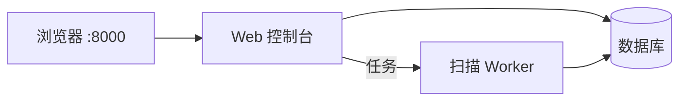

# AtlasX

**企业暴露面收集与持续监控的自托管系统。**

录入企业与根域后，AtlasX 从证书透明、测绘引擎、被动 DNS、搜索与可选主动探测等多路来源汇总影子资产，整理成可归属的资产库；完成存活探测、指纹识别与路径发现，并给出可解释的风险线索与跨轮变更对照。数据保存在本机数据库，密钥与凭据由你自行保管。

```text
http://<主机>:8000/?token=<访问令牌>
```

## 它能做什么

子域工具往往只给一张扁平清单。AtlasX 面向实战作业台：

- **连得起来** — 资产带来源与置信度，归属到企业 / 项目，并可与历史扫描对照
- **看得懂** — 优先看哪条、依据是什么，而不是黑盒分数
- **跟得住** — Web 常驻运行，凭据加密保存；支持持续扫描与变更跟踪
- **可扩展** — 免 key 源即可首扫；在设置中按需接入 FOFA、Shodan 等商业测绘与 LLM

### 采集

- 免 key 即可跑通（如证书透明、subfinder 等）
- 支持 FOFA / Quake / Shodan / Censys / Chaos / ZoomEye，以及 Bing、搜狗、GitHub 等扩展源（设置页配置后启用）
- 被动采集与主动爆破分离：主动探测需显式勾选，避免误扫面过大

### 分析与作业

- 泛解析噪声折叠，降低垃圾子域干扰
- 多源交叉佐证，提升资产可信度
- 存活探测、应用指纹、路径与 API 面线索写入资产详情
- 按企业 / 项目组织扫描；资产台、关联与变更页支持持续跟进
- 可选接入 LLM，辅助理解与预筛（默认不强制开启）

### 版本能力

| 能力 | 标准版 | Pro（License 解锁） |
|------|:------:|:------------------:|
| 多源采集 / 存活探测 / 应用指纹 | ✅ | ✅ |
| 企业 · 项目 · 资产作业台 | ✅ | ✅ |
| 关联分析与跨轮变更对照 | ✅ | ✅ |
| 可选 LLM 辅助预筛 / 理解 | ✅ | ✅ |
| 深挖分析（现象取证、假阳辨析） | — | ✅ |
| 查询 API（自动化拉资产 / 证据） | — | ✅ |
| 出站 Webhook（扫描 / 深挖完成等） | — | ✅ |
| 操作审计导出 | — | ✅ |
| 技术栈深析与手测清单 | — | ✅ |
| 《企业暴露面威胁报告》docx | — | ✅ |

未激活 License 时按标准版使用；在 **设置 → 系统** 激活后一次解锁全部 Pro 能力。

## 快速开始

**环境**：

- 系统：Linux（Debian / Ubuntu / Kali 等）
- 软件：Docker 与 Docker Compose v2，可访问 `ghcr.io`
- **最低配置：4 核 CPU / 4 GB 内存**（建议预留磁盘 ≥ 20 GB；资产与并发扫描较多时建议 8 GB 及以上）

```bash
git clone https://github.com/yingfff123/AtlasX.git && cd AtlasX && bash setup.sh
```

安装结束后，终端会打印访问地址。使用 `.env` 中的 `RADAR_ACCESS_TOKEN` 打开：

```text
http://<主机>:8000/?token=<RADAR_ACCESS_TOKEN>
```

首次登录账号（**登录后请立刻修改密码**）：

| 用户名 | 初始密码 |
|--------|----------|
| `adminx` | `Atlasx123!@#` |


## 使用流程

1. 打开 Web，登录并修改默认密码。
2. 在设置中按需填写测绘、搜索或 LLM 凭据（也可先用免 key 源完成第一次扫描）。
3. 创建企业，录入根域，发起扫描；主动爆破类选项仅在需要时勾选。
4. 在资产台查看存活、指纹、路径与风险，结合关联与变更持续跟进；需要时激活 Pro。
5. 日常升级执行 `bash update.sh`（默认保留已有数据）。

## 架构



| 组件 | 说明 |
|------|------|
| **Web** | 界面、登录鉴权、扫描与设置 |
| **Worker** | 后台采集与富化 |
| **数据库** | 资产与扫描结果持久化（随安装自动初始化） |

## 升级与数据

```bash
cd AtlasX
bash update.sh
```

- 应用与镜像升级：使用本仓库的 `update.sh`。
- 在线检查更新也可在 **设置 → 系统** 中操作（通道说明见 [AtlasX-updates](https://github.com/yingfff123/AtlasX-updates)）。

数据默认保留。若需要清空后重装：

```bash
docker compose down -v
docker compose pull
docker compose up -d
```

## 安全建议

- 访问令牌与各类 API Key 只保存在主机 `.env` 或系统设置中，不要发到公开渠道。
- 不要将数据库端口映射到公网；若 8000 对公网开放，请使用足够强的访问令牌，并尽快修改默认管理员密码。

## 相关链接

| 资源 | 地址 |
|------|------|
| 本仓库 | https://github.com/yingfff123/AtlasX |
| 容器镜像 | `ghcr.io/yingfff123/atlasx:secure` |
| 更新通道 | https://github.com/yingfff123/AtlasX-updates |

---

## 安全声明

AtlasX 仅供**已获书面授权**的安全评估、资产管理与防御研究使用。

1. **授权边界**：使用者须自行确认目标资产在授权范围内；不得对未授权系统、第三方网络或无关组织开展采集、探测或扫描。
2. **合法合规**：使用者应遵守所在地及目标所属司法辖区的法律法规、行业规范与平台规则。因超范围使用、滥用扫描能力或由此产生的任何后果，由使用者自行承担。
3. **工具属性**：本软件提供的是暴露面发现与分析能力，**不构成**对任何漏洞是否存在、是否可利用或危害等级的保证；输出结果需经人工复核后方可作为决策依据。
4. **免责**：在法律允许的最大范围内，作者与维护者不对因使用或无法使用本软件而导致的直接或间接损失承担责任；软件按「现状」提供，不附带适销性、特定用途适用性等明示或默示担保。
5. **上游责任**：通过本仓库分发的镜像与更新通道仅用于官方发布物；请勿信任来源不明的第三方修改包。

使用本软件即视为已阅读并同意上述声明。若不同意，请立即停止使用并卸载相关组件。
