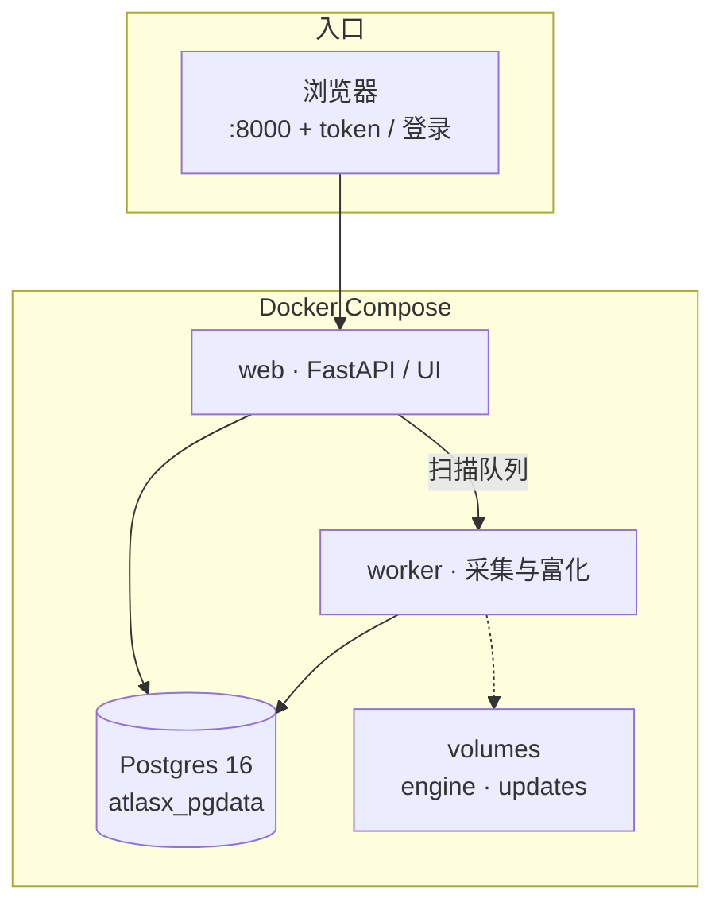

# AtlasX

**企业暴露面收集与持续监控的自托管雷达。**

输入企业与根域，AtlasX 把散落在证书透明、被动 DNS、测绘引擎与主动工具里的影子资产拉齐：归一成可归属的资产库，做存活 / 指纹 / 路径富化，给出可解释的风险与作业线索，并支持跨轮变更对照。数据落在本机 Postgres volume——**你的库、你的密钥、你的出网策略**。

本仓库是 **Linux / Docker 一键部署入口**：compose、安装脚本与护源发版镜像引用。业务核心以 `:secure` 镜像内 Nuitka `.so` 交付，**不包含**私有主仓明文核心源码。可选 License 解锁 Pro 能力（深挖、查询 API、Webhook、威胁报告等）。

```text
http://<主机>:8000/?token=<RADAR_ACCESS_TOKEN>
```

## 它解决什么

子域工具往往只给一张扁平清单。实战缺的是：

- **连得起来** — 带来源、置信度、归属证据，能和企业 / 项目 / 上轮扫描对上的资产库
- **看得懂** — 哪条值得先打、为什么，而不是黑盒分数
- **信得过** — 原始发现 append-only，算法升级可重放投影，不必整库重扫
- **收得住** — Web + Worker 常驻、凭据入库加密、公网只暴露受 token / 登录保护的入口

## 流水线（概念）

```text
根域 / 企业种子
  → 多源采集（被动测绘 · CT · 搜索 · 可选主动爆破）
  → 归一与泛解析闸（identity / wildcard）
  → 存储（Postgres · raw finding 追加）
  → 富化（DNS · 存活 · 指纹 veo · 路径 / API 面）
  → 风险与作业台（置信度 · 关联 · 变更 · Pro 深挖 / 报告）
```

## 能力概览

### 采集

- **免 key 即可跑通**：crt.sh、subfinder 等被动源；镜像内嵌 Linux 工具链（subfinder、ksubdomain、sublist3r、OneForAll、veo 等）。
- **测绘与扩展源**：FOFA / Quake / Shodan / Censys / Chaos / ZoomEye 等，以及 Bing / 搜狗 / GitHub dork 等；在设置页配置 Credential，保存即测、按源启用。
- **主动与被动分离**：被动默认可开；ksubdomain 等主动爆破需显式勾选，控制发包面。

### 去噪与置信

- **泛解析处置**：权威 NS 侧随机名探测，命中则折叠杂波；CDN 多解析剧本仍可入库。
- **多源佐证**：独立来源累加置信信号；资产带 identity / 类型 / 别名 / 首末见等属性，来源可追溯。

### 富化与作业台

- **存活与指纹**：HTTP(S) 探测 + veo 指纹；路径 / 敏感面与 API 线索进入资产详情。
- **企业 · 项目 · 扫描**：按企业组织根域与扫描任务；资产台、关联、变更页支撑持续跟进。
- **可选 LLM**：设置页接入后可增强预筛 / 风险理解等（默认不强制；深挖 LLM 默认不自动全开）。

### 开核（CE / Pro）

| | Community（看见） | Pro（解锁后） |
|---|---|---|
| 采集 / 存活 / 指纹 / 作业台 | ✅ 满血 | ✅ |
| 深挖现象、查询 API / 治理、Webhook | — | ✅ |
| 《企业暴露面威胁报告》docx、栈相关手测清单 | — | ✅ |

护源镜像可含 Pro 实现，**功能仍由 License 门闸**；未激活时按 CE 使用。

### 交付与升级

- **一键拉起**：`setup.sh` 写 `.env`、拉 GHCR、起 `db` / `web` / `worker`；空库入口自动建表 + alembic stamp。
- **双通道升级**：整包换镜像 tag（`update.sh`）；引擎 `.so` 包走 [AtlasX-updates](https://github.com/yingfff123/AtlasX-updates)。
- **数据与热更隔离**：库在 `atlasx_pgdata`；引擎 / 升级包落独立 volume，重启不丢资产。

## 快速开始

### 环境要求

- Linux（Debian / Ubuntu / Kali 等）
- Docker + Docker Compose v2
- 出网拉取 `ghcr.io`（镜像已公开，一般无需登录）

### 一条命令安装

```bash
git clone https://github.com/yingfff123/AtlasX.git && cd AtlasX && bash setup.sh
```

安装完成后终端会打印访问地址。用 `.env` 中的 `RADAR_ACCESS_TOKEN` 打开：

```text
http://<主机>:8000/?token=<RADAR_ACCESS_TOKEN>
```

默认管理员（首次启动自动引导，**登录后请立刻改密**）：

| 用户名 | 初始密码 |
|--------|----------|
| `adminx` | `Atlasx123!@#` |

## 基本工作流

1. `setup.sh` 拉起栈 → 用 token 打开 Web → 登录并**立刻改密**。
2. 设置页按需配置测绘 / 搜索 / LLM 等 Credential（免 key 源可先跑通首扫）。
3. 创建企业（或项目），录入根域，发起扫描：被动源默认可开，主动爆破需显式勾选。
4. 在资产台跟进存活、指纹、路径与风险；对照关联 / 变更；需要时激活 Pro 做深挖与报告。
5. 日常：`bash update.sh` 换镜像；引擎热更见 [AtlasX-updates](https://github.com/yingfff123/AtlasX-updates)。库 volume 默认保留。

## 镜像

默认拉取护源发版镜像：

```text
ghcr.io/yingfff123/atlasx:secure
```

`.env` 中 `ATLASX_RELEASE=1`、`ATLASX_IMAGE_TAG=secure`（`setup.sh` 会写好）。

## 部署架构

本仓交付形态是三容器栈（同一护源镜像跑 web 与 worker）：



| 组件 | 职责 |
|------|------|
| **web** | UI、鉴权、扫描编排与设置 API |
| **worker** | 出网采集、富化、队列消费（与 web 同镜像） |
| **db** | 资产事件与投影；空库由入口自动初始化 |

启动顺序：`db` healthy → entrypoint **db-init** → 业务进程。一般无需 `ATLASX_SKIP_DB_INIT`。

## 升级

```bash
cd AtlasX
bash update.sh
```

- **整包 / 壳升级**：改 `ATLASX_IMAGE_TAG` 后 `update.sh`（或 `docker compose pull && up -d`）。
- **仅引擎 so**：见 [AtlasX-updates](https://github.com/yingfff123/AtlasX-updates)，写入 `atlasx_engine` volume。

数据默认保留在 `atlasx_pgdata`。若要空库重来：

```bash
docker compose down -v
docker compose pull
docker compose up -d
```

## 开发：旁路源码构建

同级放置私有主仓 `AtlasX-clean/`，然后：

```bash
# .env
ATLASX_RELEASE=0
# setup.sh 会写入 ATLASX_ROOT / ATLASX_DOCKER_ROOT
bash setup.sh
```

在构建机推送护源镜像（建议 tmux）：

```bash
export ATLASX_ROOT=/path/to/AtlasX-clean
echo "$GHCR_TOKEN" | docker login ghcr.io -u USER --password-stdin
bash scripts/build-and-push-secure.sh
```

**禁止**把 macOS 的 `tools/bin` 打进镜像；工具须在 Linux 构建阶段安装。

## 安全建议

- 密钥与 token **只放主机 `.env`**，勿提交 git、勿 bake 进镜像。
- Postgres **不要**映射到公网；公网暴露 8000 时使用强 `RADAR_ACCESS_TOKEN`。
- 首次登录后立即修改 `adminx` 密码。
- Classic PAT / `write:packages` 仅用于推镜像的维护者机器，用完轮换。

## 仓库结构

```text
AtlasX/
  docker-compose.yml       # 发版：pull GHCR
  docker-compose.mvp.yml   # 开发：旁路主仓 build
  Dockerfile               # 护源多阶段（context = 主仓）
  setup.sh / update.sh     # 安装与升级
  scripts/                 # wait-db、构建推送等
  .env.example             # 无密钥；setup 生成正式 .env
```

## 相关链接

| 资源 | 说明 |
|------|------|
| 本仓 | https://github.com/yingfff123/AtlasX |
| 镜像 | `ghcr.io/yingfff123/atlasx` |
| 更新通道 | https://github.com/yingfff123/AtlasX-updates |

---

仅在已获授权的资产范围内使用。滥用采集与扫描能力可能违法。
